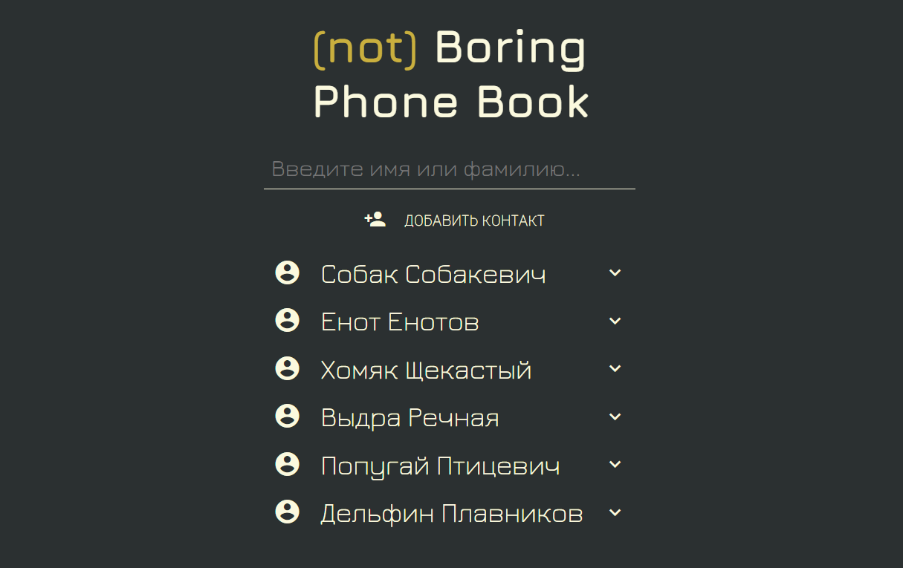
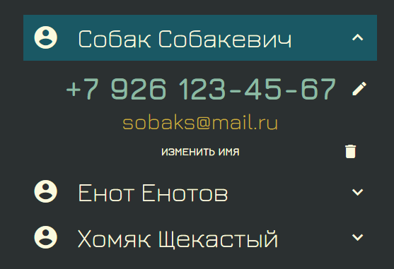
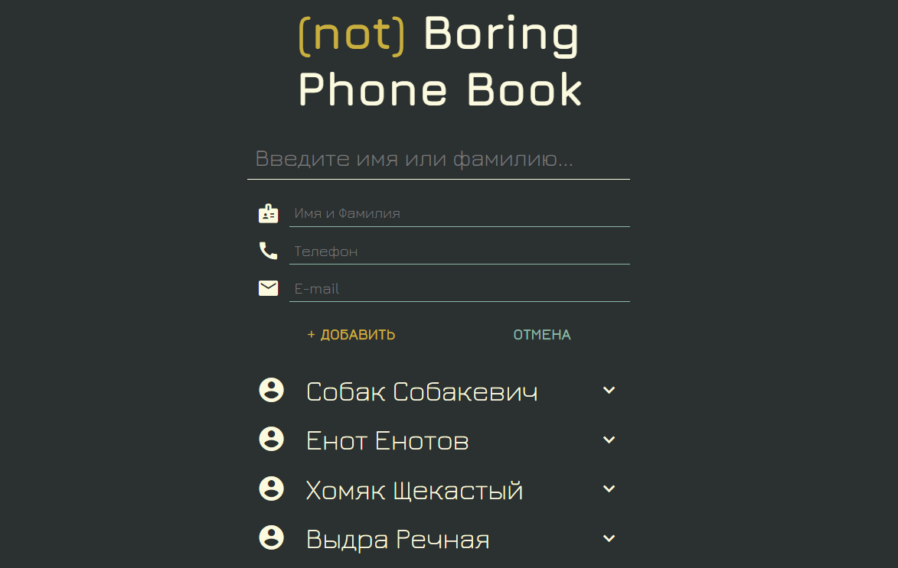

# (not) Boring Phone Book v.0.0.0.0.0.1 pre-beta

## Описание

(не) Скучная Телефонная Книга. Абсолютно бесполезная штука в контексте отдельного веб-приложения, но внедрить её, как модуль, куда-нибудь можно. Наверное...





---

### Возможности:
- добавлять контакты (имя, номер, email)
- удалять контакты
- быстрый поиск по контактам
- вносить изменения в контакты

---

### Стек:

Database:

...no

Back:

...no

Front:
- ReactJS
- Redux / Redux-Thunk
- React Router v5
- axios
- Formik

---


### Зайти в (not) Boring Phone Book DEMO:

> ...

_. . . ссылка может быть будет позже, если мне будет не лень - я залью на сервер. Сейчас вы можете посмотреть приложение только в режиме разработки. Читайте следующий раздел._

### Разработка

Если хотите поучаствовать в разработке этой бесполезной штуковины, клонируйте репозиторий себе, открывайте ваш любимый терминал:


not-boring-phone-book/
```sh
$ npm install
```

Для запуска SPA:

calendar/
```sh
$ npm start
```

---

## Что можно было бы доработать :)

- загрузка аватарок
- верстка адаптив и мобильная версия
- анимация